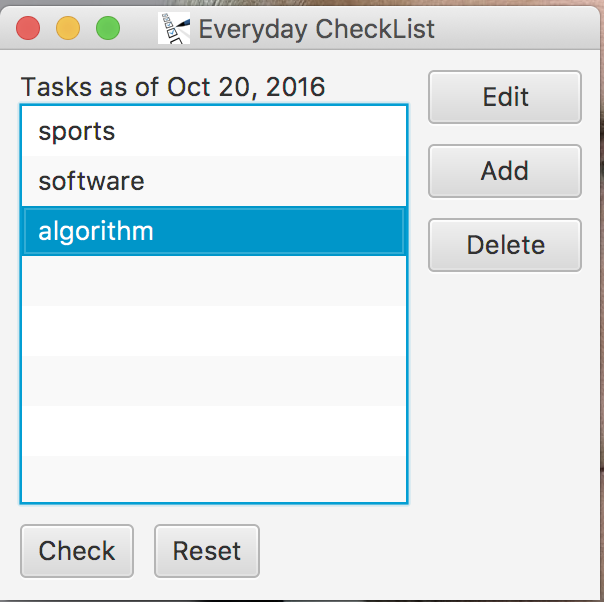
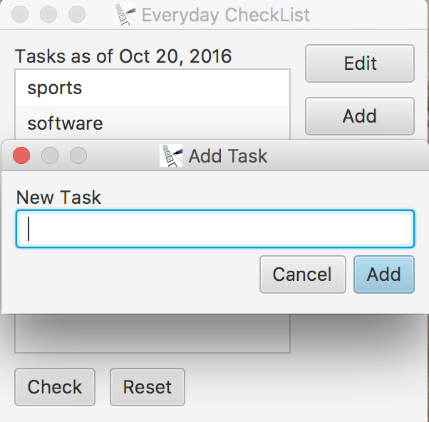
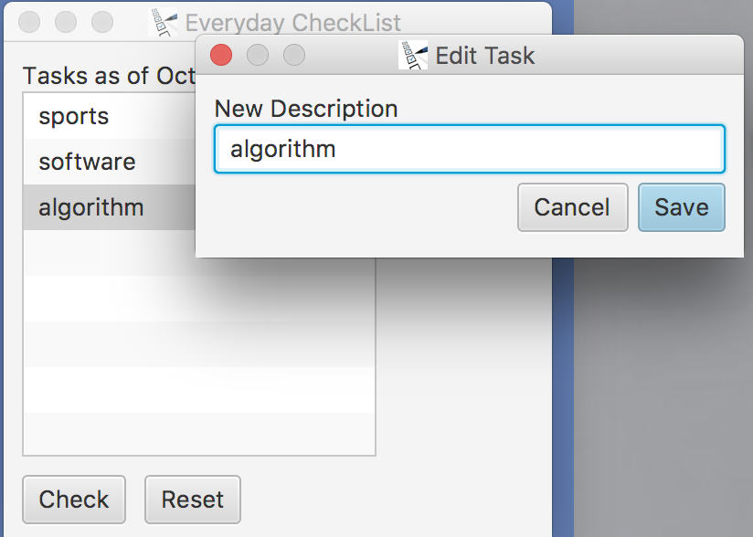
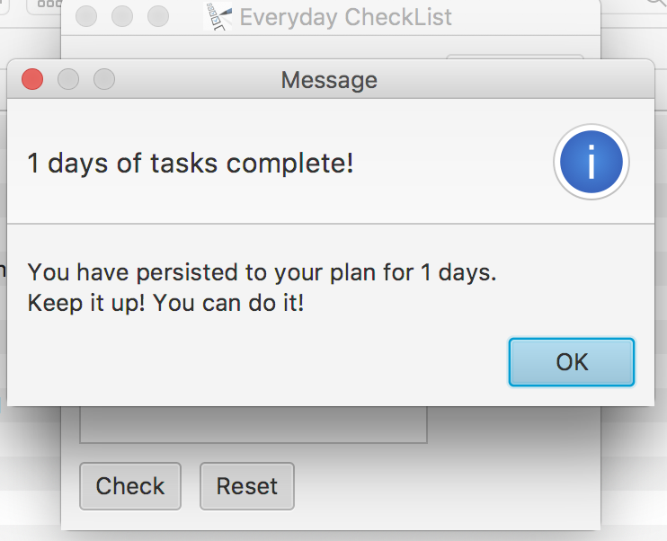

# Everyday Checklist
Make sure certain tasks are completed everyday.

## Motivations
I like to split a big, long term goal into small tasks and split small tasks into everyday efforts.
So when I have several long term tasks, I have a repeated task list everyday over a relatively long
period of time. This application helps me keep track of what needs to be done today.
## ScreenShots
### Main UI

* Reset: reset today's tasks to start a new day
* Check: complete this task

### Add A New Daily Task

### Edit Daily Task

### Congrats upon completion

## Technology Profile
JavaFX application with MVC design pattern.
